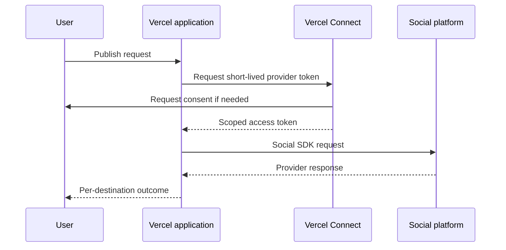

Use Vercel Connect when a Vercel application needs to call a social platform without storing a long-lived provider token in an environment variable.

Vercel Connect handles provider consent, token exchange, refresh, and revocation. Social SDK still performs the social API operation, owns connected-account references, and returns one outcome for each destination.

## How it works



## Prerequisites

- A Vercel project linked to the deployment environment.
- A Vercel Connect connector for the social provider.
- Provider OAuth credentials and scopes approved by that provider.
- An application-owned record mapping the signed-in user to the provider account ID.

Follow Vercel's [Connect quickstart](https://vercel.com/docs/connect/quickstart) to create and link a connector. Vercel Connect supports known providers and custom OAuth connectors; the connector catalog and provider permissions determine what is available.

## Install

```bash
bun add @opencoredev/social-sdk @vercel/connect
```

## Request a token for an operation

Connect tokens are short-lived. Request one while handling the operation and construct the adapter with that token.

```ts
import { getToken } from "@vercel/connect";
import { connectedAccountRef, createSocial } from "@opencoredev/social-sdk";
import { x } from "@opencoredev/social-sdk/x";

export async function publishForUser(userId: string, text: string) {
  const socialAccount = await requireAuthorizedSocialAccount(userId);
  const accessToken = await getToken("oauth/social-provider", {
    subject: { type: "user", id: userId },
    scopes: ["read", "write"],
  });

  const social = createSocial({
    backend: x({
      auth: {
        accessToken,
        userId: socialAccount.providerAccountId,
      },
    }),
  });

  return social.posts.publish({
    targets: [
      {
        account: connectedAccountRef({
          backend: "default",
          platform: "x",
          accountId: socialAccount.providerAccountId,
        }),
      },
    ],
    content: { text },
  });
}
```

Replace the connector UID, scopes, platform, and account fields with the values for your provider. `requireAuthorizedSocialAccount` represents an application-owned tenant and account lookup; do not accept the account ID from the request body.

The current direct adapters receive an access token when they are created. Creating the adapter inside the operation keeps the short-lived Connect token out of long-lived process state.

## Keep responsibilities separate

- **Vercel Connect** handles provider consent, token exchange, refresh, and revocation.
- **Your application** owns signed-in users, tenant membership, social-account records, and authorization checks.
- **Social SDK** handles platform requests, capability checks, idempotency, reconciliation, and delivery outcomes.

A successful Vercel token request does not prove that a post was published. Inspect the Social SDK result and persist each destination outcome.

## Managed backends

This recipe covers direct platform adapters. Zernio and Post for Me have their own backend credentials and account-connection flows; Vercel Connect does not replace those flows.

## Related resources

- [Choose an integration](/getting-started/choose-an-integration)
- [Tenant authorization](/concepts/tenant-authorization)
- [Publishing](/publishing)
- [Vercel Connect documentation](https://vercel.com/docs/connect)
